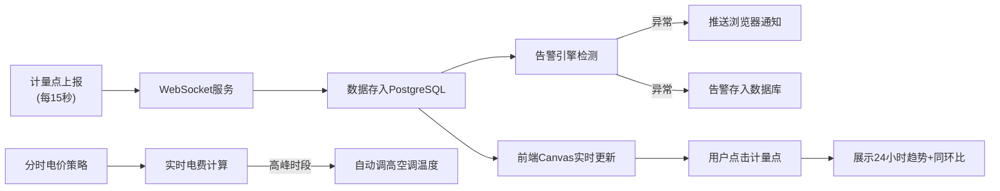

## 1. 产品概述
智能楼宇能源管理系统是面向商业综合体的能源监控与智能管理平台，通过实时采集200个能源计量点数据，实现能耗可视化、异常告警、智能节能等核心功能。

- 主要解决商业综合体能源管理粗放、异常用能难以及时发现、节能策略缺乏数据支撑等问题
- 目标用户为物业管理人员、能源管理工程师、设施运维团队
- 产品价值：降低运营成本15%-30%，减少碳排放，提升设备运行效率

## 2. 核心功能

### 2.1 用户角色
| 角色 | 注册方法 | 核心权限 |
|------|----------|----------|
| 系统管理员 | 账号密码登录 | 完整权限，包含用户管理、系统配置、电价设置 |
| 运维工程师 | 账号密码登录 | 数据监控、告警处理、设备控制 |
| 访客用户 | 无需登录 | 仅查看能耗概览数据 |

### 2.2 功能模块
1. **实时监控大屏**：楼层平面图Canvas可视化、顶部实时能耗卡片、计量点色块展示
2. **计量点详情**：24小时能耗趋势图、同比环比对比分析
3. **告警中心**：实时告警推送、告警列表、告警确认处理
4. **电价管理**：分时电价配置、实时电费计算
5. **智能控制**：电价高峰时段自动调高空调设定温度
6. **系统设置**：告警规则配置、计量点管理

### 2.3 页面详情
| 页面名称 | 模块名称 | 功能描述 |
|----------|----------|----------|
| 首页/监控大屏 | 实时能耗卡片 | 显示总用电、总用水、总燃气、总冷量四个实时数据 |
| 首页/监控大屏 | 楼层平面图 | Canvas绘制建筑平面图，200个计量点用色块表示，颜色随能耗强度变化 |
| 首页/监控大屏 | 计量点详情面板 | 点击色块弹出，显示近24小时趋势和同环比对比图 |
| 首页/监控大屏 | 告警通知栏 | 右上角实时告警气泡，支持浏览器通知 |
| 电价设置页 | 分时电价配置 | 设置峰/平/谷时段及对应电价 |
| 电价设置页 | 空调控制策略 | 配置高峰时段空调温度自动调整规则 |
| 告警中心页 | 告警列表 | 展示历史告警，支持筛选和确认 |

## 3. 核心流程
计量点每15秒通过WebSocket上报能耗数据 → 后端接收并存入PostgreSQL → 告警引擎实时检测异常 → 前端Canvas实时更新色块颜色 → 触发告警时推送浏览器通知并存入数据库 → 用户点击计量点查看详细趋势分析。

## 4. 用户界面设计

### 4.1 设计风格
- **主色调**：深蓝色(#0F172A)作为背景主色，营造专业沉稳的监控系统氛围
- **强调色**：绿色(#10B981)正常、黄色(#F59E0B)警告、红色(#EF4444)告警，构成三色能耗状态体系
- **辅助色**：青色(#06B6D4)用于数据可视化、紫色(#8B5CF6)用于空调控制
- **字体**：JetBrains Mono作为数字字体（等宽、清晰），Inter作为界面字体
- **布局**：顶部固定导航+左侧告警侧栏+中央主画布的监控大屏布局
- **视觉效果**：深色科技风格，带发光边框和渐变背景，卡片悬浮玻璃拟态效果

### 4.2 页面设计概述
| 页面名称 | 模块名称 | UI元素 |
|----------|----------|--------|
| 监控大屏 | 实时能耗卡片 | 四个圆角卡片，图标+数值+趋势箭头，渐变背景+发光边框 |
| 监控大屏 | 楼层平面图 | Canvas绘制，黑色背景+浅色网格，计量点圆角矩形色块带发光效果 |
| 监控大屏 | 详情面板 | 右侧滑入面板，带模糊背景，Chart.js绘制双轴对比图 |
| 监控大屏 | 告警通知 | 右上角悬浮气泡，红色闪烁动画，支持堆叠显示 |
| 电价设置页 | 电价配置表 | 时间轴可视化，拖拽调整峰谷时段，实时预览电费曲线 |

### 4.3 响应式
- 桌面端优先设计，针对1920x1080及以上分辨率优化
- 平板端：自适应缩放，两列布局改为单列
- 移动端：简化显示，仅展示核心数据卡片和告警列表
- Canvas画布支持响应式缩放，保持比例不变形

### 4.4 交互与动画
- 页面加载：卡片从下往上依次滑入， stagger动画
- 数据更新：数值变化时数字滚动动画，色块颜色渐变过渡
- 告警产生：红色闪烁脉冲动画，伴随提示音（可关闭）
- 面板切换：滑入滑出过渡，背景模糊渐变
- Hover效果：卡片上浮+阴影加深，计量点色块放大
