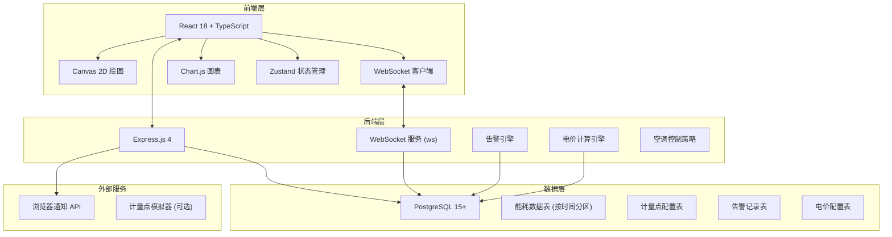
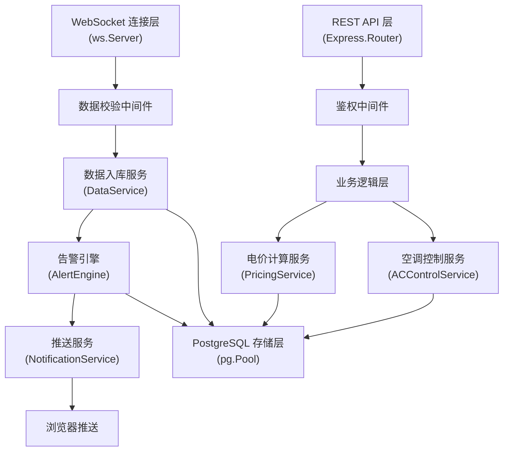
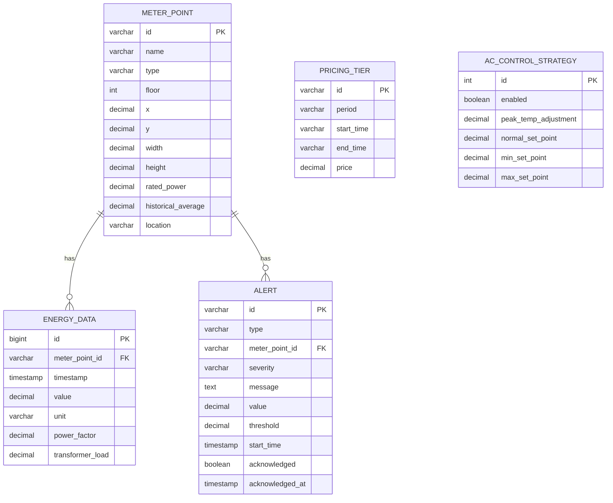

## 1. 架构设计



## 2. 技术描述

- **前端**：React@18 + TypeScript + Vite + TailwindCSS@3 + Zustand + Chart.js + lucide-react
- **后端**：Express@4 + TypeScript + WebSocket (ws库) + node-postgres (pg)
- **数据库**：PostgreSQL 15+，支持时序数据分区表
- **通信协议**：
  - WebSocket：实时数据上报（每15秒）、告警推送
  - REST API：历史数据查询、配置管理

## 3. 路由定义

| 路由 | 用途 |
|------|------|
| / | 监控大屏首页 |
| /pricing | 电价设置页面 |
| /alerts | 告警中心页面 |
| /api/meter-points | GET 获取计量点列表 |
| /api/meter-points/:id | GET 获取单个计量点详情 |
| /api/energy-data/:id/24h | GET 获取24小时能耗数据 |
| /api/energy-data/:id/compare | GET 获取同环比对比数据 |
| /api/totals | GET 获取总能耗数据 |
| /api/alerts | GET 获取告警列表 |
| /api/alerts/:id/acknowledge | POST 确认告警 |
| /api/pricing | GET/POST 分时电价配置 |
| /api/pricing/current | GET 当前时段电价和实时电费 |
| /api/ac-control | GET/POST 空调控制策略 |
| /api/ac-control/status | GET 空调当前运行状态 |

## 4. API 定义

```typescript
// 计量点类型
type MeterType = 'electricity' | 'water' | 'gas' | 'cooling';
type EnergyStatus = 'normal' | 'warning' | 'alert';

interface MeterPoint {
  id: string;
  name: string;
  type: MeterType;
  floor: number;
  x: number;
  y: number;
  width: number;
  height: number;
  ratedPower: number;
  historicalAverage: number;
  location: string;
}

interface EnergyData {
  id: string;
  meterPointId: string;
  timestamp: Date;
  value: number;
  unit: string;
  powerFactor?: number;
  transformerLoad?: number;
}

interface Alert {
  id: string;
  type: 'abnormal_usage' | 'power_factor' | 'transformer_overload';
  meterPointId: string;
  severity: 'warning' | 'critical';
  message: string;
  value: number;
  threshold: number;
  startTime: Date;
  acknowledged: boolean;
  acknowledgedAt?: Date;
}

interface PricingTier {
  period: 'peak' | 'flat' | 'valley';
  startTime: string;
  endTime: string;
  price: number;
}

interface ACControlStrategy {
  enabled: boolean;
  peakTempAdjustment: number;
  normalSetPoint: number;
  minSetPoint: number;
  maxSetPoint: number;
}

// WebSocket消息
interface WSDataReport {
  type: 'data_report';
  data: EnergyData[];
}

interface WSAlertPush {
  type: 'alert_push';
  data: Alert;
}

interface WSTotalsUpdate {
  type: 'totals_update';
  data: {
    electricity: number;
    water: number;
    gas: number;
    cooling: number;
    currentCost: number;
  };
}
```

## 5. 服务器架构图



## 6. 数据模型

### 6.1 数据模型定义



### 6.2 数据定义语言（DDL）

```sql
-- 计量点表
CREATE TABLE meter_points (
    id VARCHAR(50) PRIMARY KEY,
    name VARCHAR(200) NOT NULL,
    type VARCHAR(20) NOT NULL CHECK (type IN ('electricity', 'water', 'gas', 'cooling')),
    floor INTEGER NOT NULL,
    x DECIMAL(10, 2) NOT NULL,
    y DECIMAL(10, 2) NOT NULL,
    width DECIMAL(10, 2) NOT NULL DEFAULT 40,
    height DECIMAL(10, 2) NOT NULL DEFAULT 40,
    rated_power DECIMAL(12, 4),
    historical_average DECIMAL(12, 4) NOT NULL DEFAULT 0,
    location VARCHAR(200),
    created_at TIMESTAMP DEFAULT CURRENT_TIMESTAMP,
    updated_at TIMESTAMP DEFAULT CURRENT_TIMESTAMP
);

CREATE INDEX idx_meter_points_type ON meter_points(type);
CREATE INDEX idx_meter_points_floor ON meter_points(floor);

-- 能耗数据表（按时间分区）
CREATE TABLE energy_data (
    id BIGSERIAL,
    meter_point_id VARCHAR(50) NOT NULL REFERENCES meter_points(id),
    timestamp TIMESTAMP NOT NULL,
    value DECIMAL(12, 4) NOT NULL,
    unit VARCHAR(20) NOT NULL,
    power_factor DECIMAL(5, 4),
    transformer_load DECIMAL(5, 4),
    PRIMARY KEY (id, timestamp)
) PARTITION BY RANGE (timestamp);

-- 创建分区（按月）
CREATE TABLE energy_data_2026_06 PARTITION OF energy_data
    FOR VALUES FROM ('2026-06-01') TO ('2026-07-01');

CREATE INDEX idx_energy_data_meter_time ON energy_data(meter_point_id, timestamp DESC);
CREATE INDEX idx_energy_data_timestamp ON energy_data(timestamp DESC);

-- 告警表
CREATE TABLE alerts (
    id VARCHAR(50) PRIMARY KEY,
    type VARCHAR(30) NOT NULL CHECK (type IN ('abnormal_usage', 'power_factor', 'transformer_overload')),
    meter_point_id VARCHAR(50) NOT NULL REFERENCES meter_points(id),
    severity VARCHAR(10) NOT NULL CHECK (severity IN ('warning', 'critical')),
    message TEXT NOT NULL,
    value DECIMAL(12, 4) NOT NULL,
    threshold DECIMAL(12, 4) NOT NULL,
    start_time TIMESTAMP NOT NULL,
    acknowledged BOOLEAN DEFAULT FALSE,
    acknowledged_at TIMESTAMP,
    created_at TIMESTAMP DEFAULT CURRENT_TIMESTAMP
);

CREATE INDEX idx_alerts_meter ON alerts(meter_point_id);
CREATE INDEX idx_alerts_time ON alerts(start_time DESC);
CREATE INDEX idx_alerts_acknowledged ON alerts(acknowledged);

-- 电价配置表
CREATE TABLE pricing_tiers (
    id VARCHAR(50) PRIMARY KEY,
    period VARCHAR(10) NOT NULL CHECK (period IN ('peak', 'flat', 'valley')),
    start_time VARCHAR(5) NOT NULL,
    end_time VARCHAR(5) NOT NULL,
    price DECIMAL(10, 4) NOT NULL,
    created_at TIMESTAMP DEFAULT CURRENT_TIMESTAMP,
    updated_at TIMESTAMP DEFAULT CURRENT_TIMESTAMP
);

-- 空调控制策略表
CREATE TABLE ac_control_strategy (
    id SERIAL PRIMARY KEY,
    enabled BOOLEAN DEFAULT TRUE,
    peak_temp_adjustment DECIMAL(4, 1) NOT NULL DEFAULT 2.0,
    normal_set_point DECIMAL(4, 1) NOT NULL DEFAULT 24.0,
    min_set_point DECIMAL(4, 1) NOT NULL DEFAULT 20.0,
    max_set_point DECIMAL(4, 1) NOT NULL DEFAULT 28.0,
    created_at TIMESTAMP DEFAULT CURRENT_TIMESTAMP,
    updated_at TIMESTAMP DEFAULT CURRENT_TIMESTAMP
);

-- 初始化默认电价配置
INSERT INTO pricing_tiers (id, period, start_time, end_time, price) VALUES
('peak_1', 'peak', '08:00', '12:00', 1.25),
('peak_2', 'peak', '17:00', '21:00', 1.25),
('flat_1', 'flat', '06:00', '08:00', 0.75),
('flat_2', 'flat', '12:00', '17:00', 0.75),
('flat_3', 'flat', '21:00', '23:00', 0.75),
('valley_1', 'valley', '23:00', '06:00', 0.35);

-- 初始化默认空调控制策略
INSERT INTO ac_control_strategy (enabled, peak_temp_adjustment, normal_set_point, min_set_point, max_set_point)
VALUES (TRUE, 2.0, 24.0, 20.0, 28.0);
```
