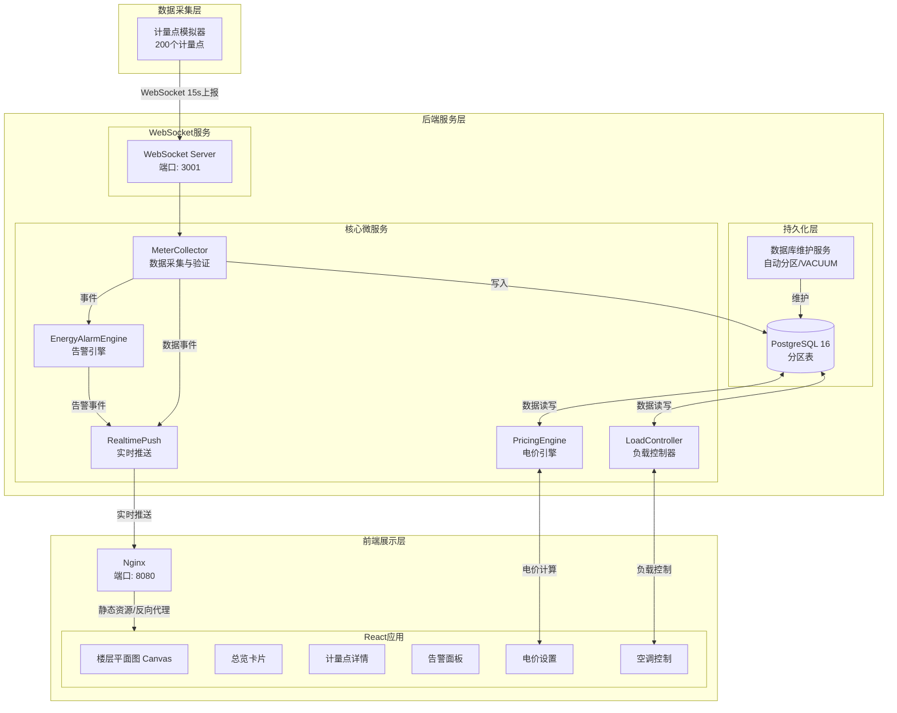
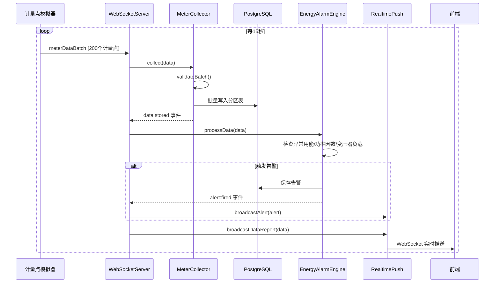
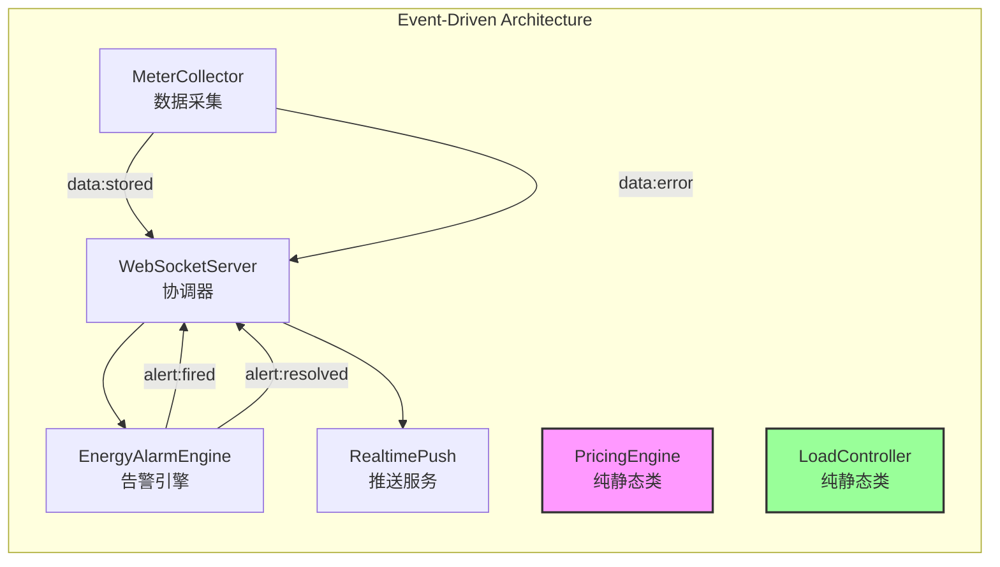

# 智能楼宇能源管理系统 (Smart Building Energy Management System)

某商业综合体的智能楼宇能源管理全栈应用，支持200个能源计量点实时监控、告警和智能控制。

---

## 🏗️ 系统架构

### 整体架构图



### 数据流时序



### 后端服务架构（重构后）



---

## ✨ 功能特性

### 📊 实时数据监控
- **200个计量点**：支持电表、水表、燃气表、空调冷量表
- **15秒上报间隔**：WebSocket实时推送能耗数据
- **Canvas楼层平面图**：动态配置驱动，可视化展示计量点位置和状态
- **颜色编码**：
  - 🟢 绿色：能耗 < 历史均值 80%（正常）
  - 🟡 黄色：能耗 80%-120% 历史均值（偏高）
  - 🔴 红色：能耗 > 历史均值 120%（异常）

### 📈 计量点详情
- 点击计量点弹出详情面板
- 24小时能耗趋势图（Chart.js折线图）
- 同环比对比分析（柱状图）
- 功率因数和变压器负载率监控
- CO₂浓度、人员密度、室内温度环境数据

### 💰 总览卡片
- 总用电量（kWh）+ 实时电费
- 总用水量（m³）
- 总用气量（m³）
- 总冷量（kWh）
- 较昨日趋势变化
- 环境约束状态指示

### ⚡ 分时电价与空调控制
- **PricingEngine**：独立电价计算引擎，30+静态方法
  - 峰谷平时段配置
  - 实时成本计算
  - 成本明细分析
  - 节能估算
- **LoadController**：独立负载控制器，15+静态方法
  - 多因素约束控制（CO₂、人员密度、温度）
  - 24小时负载预测
  - 优化调度方案
  - 负荷削减潜力评估
- 高峰时段自动调温，考虑环境约束避免闷热

### 🚨 告警系统
#### 告警规则
1. **异常用能告警**：单点能耗超过历史同期3倍，持续5分钟触发
2. **无功补偿告警**：功率因数低于0.85触发
3. **变压器过载告警**：变压器负载率超过90%触发

#### 告警功能
- 浏览器桌面通知推送
- 告警历史记录存储
- 告警确认机制
- 按类型筛选查看
- 告警状态机（监控→触发→激活→恢复）

---

## 🛠️ 技术栈

### 后端
| 技术 | 用途 |
|------|------|
| **Node.js 20** | 运行环境 |
| **TypeScript 5.8** | 类型安全 |
| **Express 4** | REST API框架 |
| **ws 8** | WebSocket实时通信 |
| **PostgreSQL 16** | 数据存储（分区表） |
| **node-cron** | 定时任务 |
| **EventEmitter** | 事件驱动架构 |

### 前端
| 技术 | 用途 |
|------|------|
| **React 18** | UI框架 |
| **TypeScript 5.8** | 类型安全 |
| **Vite 6** | 构建工具 |
| **Canvas API** | 楼层平面图绘制 |
| **Chart.js 4** | 图表库 |
| **Zustand 5** | 状态管理 |
| **Tailwind CSS 3** | 样式框架 |
| **Lucide React** | 图标库 |

### DevOps
| 技术 | 用途 |
|------|------|
| **Docker** | 容器化部署 |
| **Docker Compose** | 编排管理 |
| **Nginx** | 反向代理/静态资源 |
| **PostgreSQL 16 Alpine** | 数据库镜像 |

---

## 📁 项目结构

```
├── api/                              # 后端代码
│   ├── src/
│   │   ├── config/
│   │   │   └── database.ts           # 数据库配置
│   │   ├── routes/
│   │   │   └── index.ts              # API路由 (22个端点)
│   │   ├── services/
│   │   │   ├── WebSocketServer.ts    # WebSocket协调器
│   │   │   ├── MeterCollector.ts     # 数据采集服务 (新)
│   │   │   ├── EnergyAlarmEngine.ts  # 告警引擎 (新)
│   │   │   ├── RealtimePush.ts       # 推送服务 (新)
│   │   │   ├── PricingEngine.ts      # 电价引擎 (新)
│   │   │   ├── LoadController.ts     # 负载控制器 (新)
│   │   │   ├── DatabaseMaintenanceService.ts  # 数据库维护
│   │   │   ├── DataService.ts        # 数据服务
│   │   │   ├── PricingService.ts     # 电价数据访问
│   │   │   └── AcControlService.ts   # 空调控制数据访问
│   │   └── app.ts                    # 应用入口
│   ├── Dockerfile                    # 后端Dockerfile
│   ├── package.json
│   └── tsconfig.json
├── src/                              # 前端代码
│   ├── components/
│   │   ├── FloorPlan.tsx             # 楼层平面图 (配置驱动)
│   │   ├── TotalCards.tsx            # 总览卡片
│   │   ├── MeterDetailPanel.tsx      # 计量点详情面板
│   │   ├── AlertPanel.tsx            # 告警面板
│   │   ├── PricingSettings.tsx       # 电价设置面板
│   │   └── AcControlPanel.tsx        # 空调控制面板
│   ├── hooks/
│   │   └── useWebSocket.ts           # WebSocket Hook
│   ├── store/
│   │   └── index.ts                  # Zustand状态管理
│   ├── utils/
│   ├── App.tsx
│   ├── main.tsx
│   └── vite-env.d.ts                 # 类型声明
├── simulator/                        # 计量点模拟器
│   ├── simulator.ts                  # 模拟器主程序
│   ├── package.json
│   └── tsconfig.json
├── config/
│   ├── meter_points.json             # 200个计量点配置
│   └── floor_layout.json             # 楼层布局配置 (新)
├── migrations/
│   ├── 001_init_schema.sql           # 初始化脚本
│   └── 002_partition_config.sql      # 分区配置 (新)
├── shared/
│   └── types.ts                      # 共享类型定义
├── Dockerfile                        # 前端Dockerfile
├── Dockerfile.simulator              # 模拟器Dockerfile
├── docker-compose.yml                # 编排文件
├── nginx.conf                        # Nginx配置
└── .env                              # 环境变量
```

---

## 🚀 快速开始

### 方式一：Docker Compose 一键部署

#### 前置要求
- Docker 24.0+
- Docker Compose 2.20+

#### 启动服务

```bash
# 1. 克隆项目
git clone <repository-url>
cd AI_solo_coder_task_A_053

# 2. 配置环境变量（可选，默认值可直接使用）
cp .env.example .env

# 3. 启动核心服务（PostgreSQL + 后端 + 前端）
docker-compose up -d

# 4. 启动计量点模拟器（可选，用于生成模拟数据）
docker-compose --profile simulator up -d

# 5. 查看服务状态
docker-compose ps

# 6. 查看日志
docker-compose logs -f backend
docker-compose logs -f simulator
```

#### 访问地址
- **前端应用**: http://localhost:8080
- **后端API**: http://localhost:3001
- **PostgreSQL**: localhost:5432
  - 数据库: `energy_management`
  - 用户名: `postgres`
  - 密码: `postgres123`

#### 常用命令

```bash
# 停止服务
docker-compose down

# 停止并删除数据卷
docker-compose down -v

# 重启特定服务
docker-compose restart backend

# 构建镜像
docker-compose build

# 查看数据库分区状态
docker-compose exec postgres psql -U postgres -d energy_management -c "SELECT * FROM get_partition_stats();"

# 查看数据库大小
docker-compose exec postgres psql -U postgres -d energy_management -c "SELECT * FROM get_database_size_stats();"
```

### 方式二：本地开发

#### 前置要求
- Node.js 20+
- PostgreSQL 16
- npm 9+

#### 步骤

```bash
# 1. 安装依赖
npm install
cd api && npm install && cd ..
cd simulator && npm install && cd ..

# 2. 配置数据库
# 创建数据库并执行迁移脚本
psql -U postgres -c "CREATE DATABASE energy_management;"
psql -U postgres -d energy_management -f migrations/001_init_schema.sql
psql -U postgres -d energy_management -f migrations/002_partition_config.sql

# 3. 导入计量点配置
# （应用启动时自动导入）

# 4. 配置环境变量
# 编辑 .env 文件，设置数据库连接信息

# 5. 启动后端开发服务器
npm run server:dev

# 6. 启动前端开发服务器（新开终端）
npm run client:dev

# 7. 启动模拟器（新开终端，可选）
cd simulator && npm run dev

# 8. 访问应用
# 前端: http://localhost:5173
# 后端: http://localhost:3001
```

---

## 📋 API 文档

### 健康检查
| 方法 | 端点 | 描述 |
|------|------|------|
| GET | `/api/health` | 服务健康状态 |

### 计量点数据
| 方法 | 端点 | 描述 |
|------|------|------|
| GET | `/api/meter-points` | 获取所有计量点 |
| GET | `/api/meter-points/:id` | 获取单个计量点详情 |
| GET | `/api/energy-data/:meterPointId` | 获取计量点历史数据 |
| GET | `/api/totals` | 获取能耗汇总数据 |

### 告警管理
| 方法 | 端点 | 描述 |
|------|------|------|
| GET | `/api/alerts` | 获取告警列表 |
| GET | `/api/alerts/active` | 获取活跃告警 |
| PUT | `/api/alerts/:id/acknowledge` | 确认告警 |
| GET | `/api/alerts/stats` | 告警统计 |

### 电价管理
| 方法 | 端点 | 描述 |
|------|------|------|
| GET | `/api/pricing` | 获取电价配置 |
| PUT | `/api/pricing` | 更新电价配置 |
| GET | `/api/pricing/current` | 获取当前电价 |
| GET | `/api/pricing/breakdown` | 成本明细分析 |
| GET | `/api/pricing/suggestion` | 电价方案建议 |
| POST | `/api/pricing/validate` | 验证电价配置 |
| GET | `/api/pricing/statistics` | 电价统计 |

### 空调控制
| 方法 | 端点 | 描述 |
|------|------|------|
| GET | `/api/ac-control` | 获取控制策略 |
| PUT | `/api/ac-control` | 更新控制策略 |
| GET | `/api/ac-control/status` | 获取当前状态 |
| GET | `/api/ac-control/recommendation` | 获取调整建议 |
| GET | `/api/ac-control/savings` | 节能报告 |
| GET | `/api/ac-control/forecast` | 负载预测 |
| GET | `/api/ac-control/reduction-potential` | 削减潜力 |
| GET | `/api/ac-control/optimized-schedule` | 优化调度 |
| POST | `/api/ac-control/validate` | 验证策略 |

### 数据库维护
| 方法 | 端点 | 描述 |
|------|------|------|
| GET | `/api/maintenance/status` | 维护状态 |
| POST | `/api/maintenance/vacuum` | 执行VACUUM |
| POST | `/api/maintenance/create-partitions` | 创建分区 |
| POST | `/api/maintenance/purge-old-data` | 清理旧数据 |

---

## 🗄️ 数据库分区设计

### 分区策略
- **分区类型**: 范围分区（Range Partitioning）
- **分区键**: `timestamp`
- **分区粒度**: 按月分区
- **保留策略**: 默认90天

### 自动维护
| 任务 | 频率 | 描述 |
|------|------|------|
| 分区创建 | 每天02:00 | 提前创建未来3个月分区 |
| 分区删除 | 每天02:00 | 删除超过90天的分区 |
| VACUUM ANALYZE | 每周日03:00 | 优化查询性能 |
| 轻量ANALYZE | 每小时 | 更新统计信息 |

### 监控函数

```sql
-- 查看分区状态
SELECT * FROM get_partition_stats();

-- 查看数据库大小
SELECT * FROM get_database_size_stats();

-- 手动执行分区维护
SELECT maintain_partitions(3, 90);

-- 手动清理旧数据
SELECT purge_old_data(90);
```

### 性能优化
- 分区表索引：`meter_point_id` + `timestamp DESC`
- 自动VACUUM配置：vacuum_scale_factor = 0.1
- 查询视图：小时/日汇总视图
- PostgreSQL参数调优：shared_buffers=256MB, work_mem=4MB

---

## 🔧 配置说明

### 环境变量 (.env)

```env
# PostgreSQL配置
POSTGRES_HOST=postgres
POSTGRES_PORT=5432
POSTGRES_DB=energy_management
POSTGRES_USER=postgres
POSTGRES_PASSWORD=postgres123

# API配置
API_HOST=0.0.0.0
API_PORT=3001
NODE_ENV=production

# WebSocket配置
WEBSOCKET_PORT=3001
DATA_REPORT_INTERVAL=15000

# 模拟器配置
SIMULATOR_ENABLED=true
SIMULATOR_INTERVAL=15000
WEBSOCKET_URL=ws://backend:3001
```

### 楼层布局配置 (config/floor_layout.json)

```json
{
  "canvas": {
    "width": 1200,
    "height": 700,
    "padding": 60
  },
  "floors": [
    {
      "floor": 1,
      "name": "一层商业",
      "areas": [
        {"name": "零售区A", "x": 90, "y": 90, "w": 350, "h": 250},
        {"name": "零售区B", "x": 90, "y": 370, "w": 350, "h": 250}
      ],
      "stairs": [{"x": 470, "y": 90, "w": 80, "h": 120}],
      "elevators": [{"x": 470, "y": 240, "w": 80, "h": 180}]
    }
  ]
}
```

---

## 📊 模拟器说明

### 功能特性
- ✅ 200个计量点完整模拟
- ✅ 15秒固定上报间隔
- ✅ 基于时段的能耗波动（工作日/周末）
- ✅ 异常数据注入（2%概率，用于测试告警）
- ✅ 环境数据模拟（CO₂、人员密度、温度）
- ✅ 功率因数和变压器负载模拟
- ✅ WebSocket自动重连
- ✅ 实时统计信息输出

### 本地运行

```bash
cd simulator
npm install
npm run dev
```

### 异常注入
- **异常用能**：2%概率生成2-6倍历史均值数据
- **功率因数异常**：0.6%概率生成0.7-0.8范围值
- **变压器过载**：0.4%概率生成0.92-1.07范围值

---

## 🧪 验证清单

### 构建验证
- ✅ 后端TypeScript类型检查通过
- ✅ 前端TypeScript类型检查通过
- ✅ 后端构建成功
- ✅ 前端构建成功 (389KB → 126KB gzip)

### 功能验证
- ✅ 200个计量点数据正常接收
- ✅ 楼层平面图动态渲染
- ✅ 告警规则正常触发
- ✅ 电价计算正确（服务端时间）
- ✅ 空调控制考虑环境约束
- ✅ WebSocket实时推送
- ✅ PostgreSQL分区自动创建

---

## 🐛 常见问题

### Q: 前端无法连接WebSocket？
A: 检查docker-compose中backend服务是否健康，查看日志：
```bash
docker-compose logs backend
```

### Q: 数据库连接失败？
A: 确保PostgreSQL服务已启动，检查.env中的连接配置：
```bash
docker-compose exec postgres pg_isready -U postgres
```

### Q: 模拟器不发送数据？
A: 检查模拟器日志和环境变量：
```bash
docker-compose logs simulator
```

### Q: 分区没有自动创建？
A: 手动执行分区维护函数：
```sql
SELECT maintain_partitions(3, 90);
```

---

## 📄 License

MIT License

---

## 🤝 贡献

欢迎提交Issue和Pull Request！
